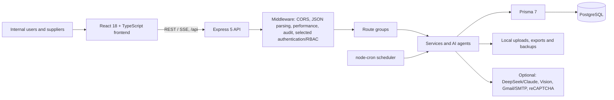
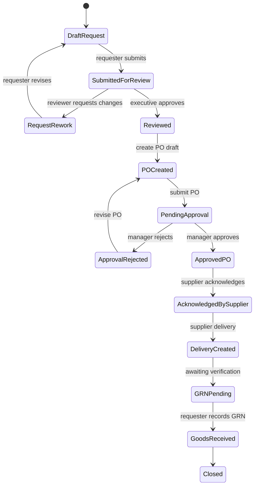

# OptiMind ERP — FYP Report Foundation

> **Purpose.** This is the code-verified source document for writing the Final Year Project report. It describes the system that exists in the current repository, rather than a proposed or historical version. Use it as the factual basis for Chapters 1–5, then adapt the university-required formatting, citations, and results to the final report.
>
> **Verification date:** 1 September 2026  
> **Project name in repository:** OptiMind ERP Portal  
> **Suggested report title:** *Design and Development of OptiMind: An Intelligent Procurement, Supplier Fulfilment and Budget Forecasting ERP Portal*

## 1. Scope, evidence, and writing rules

### 1.1 What was reviewed

The current application source comprises approximately 237 backend files, 318 frontend source files, 28 PlantUML diagram files, and 116 project documents. The review used the executable code and current schema as the source of truth:

- `backend/server.js` — Express composition and API route registration.
- `backend/prisma/schema.prisma` and migrations — PostgreSQL persistence model.
- `backend/routes/`, `backend/services/`, `backend/agents/`, and `backend/middleware/` — API, business logic, AI, automation, and authorization behaviour.
- `client/src/FrontEnd/` and `client/src/i18n/` — React user interface, routes, client persistence, API calls, and localisation.
- `Diagram/*.puml` — maintained architecture, ERD, state, sequence, activity, DFD, component, deployment, and use-case diagrams.
- `README.md`, package manifests, test configuration, and test files — environment, libraries, and quality evidence.

Generated Prisma client code, `node_modules`, runtime logs, backups, uploads, old copies, and secret values were not used as report evidence. Environment configuration was checked only by variable name; passwords, API keys, tokens, connection strings, uploaded data, and service-account material must **never** appear in the report or appendix.

### 1.2 Important accuracy rule

Some older documents describe an earlier architecture (for example, an older database choice). The current source uses **PostgreSQL with Prisma 7**, as declared in `backend/prisma/schema.prisma` and `backend/package.json`. Cite or describe historical documents only as development history; do not use them to describe the final implementation without code verification.

### 1.3 How to use this file

1. Treat the prose under each chapter as report-ready content that can be edited for the faculty template.
2. Replace bracketed placeholders such as `[University Name]`, `[Student Name]`, and measured test results with final information.
3. Add academic sources for ERP, RBAC, forecasting, AI governance, and software engineering methods. Repository documents are implementation evidence, not academic references.
4. Use screenshots from the running system and rendered versions of the linked PlantUML diagrams in the final report.

---

## 2. Draft abstract

### English draft

Procurement, supplier fulfilment, and departmental budget control are often managed through disconnected records, manual follow-up, and delayed communication. This project develops **OptiMind**, a web-based Enterprise Resource Planning (ERP) portal that integrates purchase requests, purchase orders, supplier acknowledgement, delivery, goods received note (GRN) verification, supplier invoice and payment processing, departmental budget management, notifications, audit records, exports, and AI-assisted analysis. The system is implemented as a React and TypeScript frontend with a Node.js and Express backend, PostgreSQL persistence through Prisma ORM, and optional integrations for language models, computer vision, Gmail/SMTP, and reCAPTCHA. A role-based access model supports administrative, management, departmental, finance, payment, employee, and supplier users. The procurement workflow provides traceable status transitions from request drafting to goods receipt, including a discrepancy-and-redelivery loop. The budgeting module records monthly allocation, reservation and expenditure, supports budget adjustments and upcoming-event risk signals, and generates departmental forecasts using an analytics agent with a moving-average fallback. The resulting system centralises operational information, provides in-application and email notifications, supports English, Simplified Chinese, and Bahasa Malaysia, and supplies export, audit, and backup facilities. Evaluation should measure functional correctness, role access, workflow traceability, forecast behaviour, usability, and response performance using a separate test database and representative user scenarios.

**Keywords:** ERP; procurement workflow; supplier fulfilment; budget forecasting; role-based access control; multi-agent AI; web application.

### 中文摘要草稿

采购、供应商履约与部门预算控制若由分散记录和人工追踪处理，容易出现沟通延迟、状态不透明及预算风险难以及时发现的问题。本项目开发 OptiMind ERP Portal，把采购申请、采购订单、供应商确认、交付、收货单（GRN）验证、供应商发票与付款、部门预算、通知、审计、导出及 AI 辅助分析整合到同一网页系统。系统以前端 React/TypeScript、后端 Node.js/Express、Prisma ORM 与 PostgreSQL 实现，并可选接入大语言模型、图像识别、Gmail/SMTP 及 reCAPTCHA。系统以角色为基础控制访问权限，并完整追踪采购从草稿到收货的状态，包含货物差异后的重新交付循环。预算模块记录每月拨款、预留与支出，支持预算调整和即将发生事件的风险信号，并以分析 Agent 生成部门预算预测，同时保留移动平均的降级计算方法。系统支持英文、简体中文及马来文，并提供应用内/邮件通知、导出、审计及备份功能。最终评估应以独立测试数据库和代表性用户情境验证功能正确性、权限控制、工作流可追踪性、预测行为、易用性及响应性能。

---

## 3. Chapter 1 — Introduction

### 3.1 Background and problem statement

An organisation’s procurement lifecycle crosses several parties: a requester identifies a need, an executive reviews the request, a manager authorises the purchase order, a supplier acknowledges and delivers the goods, and the receiving party verifies them. Finance and payment teams subsequently process invoices and payments. When these steps are kept in separate documents or informal communication channels, stakeholders cannot easily see the current status, approvals may be delayed, and budget usage can be discovered only after spending has occurred.

OptiMind addresses this operational gap by providing a single web portal for the purchase-to-payment lifecycle and by connecting it with departmental budgets. It also uses AI-assisted functions to help users analyse spending, evaluate purchase risk, coordinate supplier activity, generate documents, and forecast future departmental budget needs. AI output is advisory; the human approval workflow remains responsible for operational decisions.

### 3.2 Aim

To design and develop a role-aware web-based ERP portal that centralises procurement, supplier fulfilment, financial processing, departmental budget management, notifications, and AI-assisted decision support.

### 3.3 Objectives

The following objectives are directly supported by the implemented system:

1. Provide secure account administration, profile management, password recovery, active/inactive account control, and role-aware navigation.
2. Digitise the procurement lifecycle from purchase request creation through executive review, purchase-order approval, supplier acknowledgement, delivery, and GRN verification.
3. Support supplier inventory, tax settings, bank details, invoice approval, payment processing, and document/PDF generation.
4. Record monthly departmental budgets, reserved and spent amounts, adjustment requests, upcoming events, historical trends, thresholds, and AI-assisted forecasts.
5. Deliver workflow, budget, and feedback notifications through the application and, when configured, email.
6. Provide multilingual interaction in English, Simplified Chinese, and Bahasa Malaysia.
7. Add an AI assistant and specialised agents while preserving explicit user review and workflow approval.
8. Provide operational support through exports, audit logs, backup history, database inspection, and performance/debug endpoints.

### 3.4 Scope and users

| Role | Primary responsibilities in OptiMind |
| --- | --- |
| Admin | User and role administration, lookup configuration, oversight, and selected finance/budget capabilities. |
| Manager | Purchase-order approval, department-level oversight, and permitted budget operations. |
| Department Executive | Purchase-request review/approval, purchase-order preparation, and department budget participation. |
| Treasury / Finance Officer | Invoice review and approval; budget adjustment review. |
| Payment Team | Payment processing after invoice approval. |
| Employee | Purchase-request creation, receipt/GRN actions, notifications, feedback, and relevant workflow tracking. |
| Supplier | Order acknowledgement, delivery updates, supplier inventory, tax/bank details, invoice submission, and supplier-facing tracking. |

The canonical role values are maintained in `backend/constants/roles.js` and mirrored in the frontend type definitions.

### 3.5 Suggested contribution statement

The principal contribution of OptiMind is an integrated, traceable purchase-to-payment and budget-control prototype that combines conventional ERP workflow controls with multilingual interaction, notifications, document output, and bounded AI decision support. The implementation also demonstrates how forecast recommendations can be connected to monthly budget operations while retaining a non-AI fallback path.

---

## 4. Chapter 2 — Related work and proposed approach

This chapter requires external academic citations. The following structure is recommended.

| Topic to research | Why it matters to this project | How OptiMind applies it |
| --- | --- | --- |
| ERP and digital procurement | Establishes the value of integrating operational functions and approval records. | One portal covers requests, orders, fulfilment, finance, budget, exports, and governance. |
| Workflow management and BPM | Supports explicit states, roles, exceptions, and traceability. | PR → PO → supplier acknowledgement → delivery → GRN, with rejection/rework and discrepancy loops. |
| RBAC | Explains the least-privilege concept for multi-party enterprise systems. | Seven roles are reflected in navigation and protected backend routes. |
| Budget forecasting | Justifies historical-data forecasting, confidence, and fallback strategies. | Department forecasts use analytics-agent output and a three-month moving-average fallback. |
| Explainable/advisory AI | Frames AI recommendations as support rather than autonomous authority. | AI agents expose domain-specific tools; human approval and finance roles retain control. |
| Usability and multilingual systems | Supports accessible, inclusive user interaction. | English, Simplified Chinese, and Bahasa Malaysia locale namespaces are implemented. |
| Web application security | Provides standards for auth, validation, encryption, audit, and privacy. | Current implementation includes password hashing, reset-code controls, audit, and roles; production hardening remains future work. |

### Proposed methodology wording

An iterative, prototype-oriented software development approach is appropriate for this FYP. Requirements can be gathered from the roles and operational steps of a procurement process, translated into use cases and workflow diagrams, implemented incrementally by module, and evaluated with unit, integration, route, UI, and scenario-based testing. The repository history and diagram set show iterative enhancement of workflow, forecasting, email content, tax settings, language support, tracking, and agent features. In the final report, include a timeline or sprint table with actual dates and commit evidence where appropriate.

---

## 5. Chapter 3 — System analysis and design

### 5.1 Functional requirements

| ID | Requirement | Implemented evidence |
| --- | --- | --- |
| FR-01 | Users can log in, recover passwords, update a profile, and upload an avatar. | `routes/auth.js`, `controllers/authController.js`, avatar upload middleware. |
| FR-02 | Administrators can create, edit, activate/deactivate users, and change roles with an audit trail. | `routes/adminUsers.js`, `role_change_audits`. |
| FR-03 | Users can create purchase requests, save drafts, submit them, review them, and process rework/rejection. | Purchasing pages and `purchase_request_records`. |
| FR-04 | Approved purchase requests can form purchase-order drafts for manager approval. | Purchase-order pages and `purchase_order_records`. |
| FR-05 | Suppliers can acknowledge orders, manage delivery records, and participate in GRN discrepancy resolution. | Supplier fulfilment pages and workflow stores. |
| FR-06 | Finance and payment roles can process supplier invoices and payments. | `routes/supplierFinance.js`, invoice/payment record stores. |
| FR-07 | Departments can maintain monthly budgets, submit adjustments, record events, examine use and trends, and request predictions. | `routes/department-budget.js`, budget models/services. |
| FR-08 | The system can notify users in-app and by email when configured. | `services/notifications.js`, `services/emailNotifications.js`, `notification-service.js`. |
| FR-09 | Users can converse with a chatbot or specialised AI agents, save sessions, and use attachments/sources. | `routes/chatbot.js`, `routes/agents.js`, `agents/`, chat/source models. |
| FR-10 | Users can export workflow data as HTML/PDF, Excel, CSV, or JSON. | `routes/export.js`, PDF/export services. |
| FR-11 | Users can switch among three supported languages. | `client/src/i18n/config.ts` and `locales/en`, `locales/zh`, `locales/ms`. |
| FR-12 | Administrators/operators can inspect audit, backup, database, and debug/performance information. | Audit, backup, database, and debug route groups. |

### 5.2 Non-functional requirements

| Area | Current design response |
| --- | --- |
| Usability | React single-page interface, Ant Design components, role-aware menus, breadcrumbs, search/filter tables, dashboard cards, error boundary, and user guide UI. |
| Performance | React lazy-loaded pages, Webpack content-hashed chunks, Prisma/PostgreSQL indexes, bounded workflow pagination, performance middleware, and scheduled background work. |
| Reliability | Prisma transactions for workflow replacement/upsert; notification failures are handled asynchronously; forecast service has a moving-average fallback. |
| Maintainability | Separate route, service, agent, middleware, Prisma, frontend module, and shared API layers. |
| Portability | JavaScript/TypeScript web stack; configuration via environment variables; development proxy supports separate frontend/backend processes. |
| Localisation | i18next namespaces cover application domains in `en`, `zh`, and `ms`. |
| Auditability | Audit and role-change records; workflow status, notification references, and export/backup history are persisted. |

### 5.3 System architecture



The frontend is a React 18 application written in TypeScript and bundled by Webpack 5. It uses React Router 6 for page navigation, Ant Design 6 and chart libraries for the interface, Axios for API communication, and i18next for localisation. The development server proxies `/api` and `/uploads` requests to the Express backend.

The backend is an ES-module Node.js application built with Express 5. Its `server.js` registers the route groups, serves runtime uploads, starts the budget scheduler, and listens on port 4000. Route handlers delegate to services for notifications, email, budgeting, AI, exports, PDF creation, backup, and audit work. Prisma 7 accesses a PostgreSQL database.

Existing diagram assets suitable for Chapter 3 figures include:

- `Diagram/system-architecture.puml` — detailed system architecture.
- `Diagram/component-system.puml` — component view.
- `Diagram/deployment-system.puml` — deployment view.
- `Diagram/dfd-level0.puml` — Level 0 DFD.
- `Diagram/use-case-system.puml` — use-case model.
- `Diagram/erd-system.puml` and `Diagram/erd-logical-workflow.puml` — data model.

### 5.4 Backend API organisation

All main business endpoints use the `/api` prefix. The following summary is more useful for a report than listing every endpoint.

| Route group | Responsibility |
| --- | --- |
| `/api/login`, `/api/profile`, `/api/forgot-password`, `/api/reset-password` | Authentication, profile and password recovery. |
| `/api/admin` | User accounts, active status, roles, and role-change audit. |
| `/api/purchasing` | Purchasing lookups, supplier inventory, and inventory reservation actions. |
| `/api/workflow` | Snapshot persistence for PR, PO, order acknowledgement, delivery, and GRN records. |
| `/api/supplier-finance`, `/api/supplier-tax` | Supplier bank/tax data, invoices, payments, printing, and PDFs. |
| `/api/budget`, `/api/department-budget` | Forecasts, monthly budgets, upcoming events, adjustment requests, usage, and trends. |
| `/api/chatbot`, `/api/agents`, `/api/sources` | Chat, specialised agent sessions, streaming, file sources, and attachments. |
| `/api/notifications`, `/api/feedback`, `/api/dashboard` | Notification state, feedback, and summary statistics. |
| `/api/export` | HTML/PDF, Excel, CSV, and JSON export. |
| `/api/audit`, `/api/backup`, `/api/database`, `/api/debug`, `/api/gmail` | Operational, audit, backup, database inspection, performance/log, and Gmail OAuth support. |

### 5.5 Data design

The physical database schema contains the following main groups.

| Group | Main tables/models | Purpose |
| --- | --- | --- |
| Identity and governance | `users`, `role_change_audits`, `password_reset_codes`, `audit_logs`, `backup_history` | User lifecycle, password recovery, traceability, and operations. |
| Organisation and budget | `departments`, `monthly_budgets`, `budget_predictions`, `budget_adjustment_requests`, `budget_upcoming_events` | Department master data, monthly control, predictions, workflow changes, and future risks. |
| Workflow snapshots | `purchase_request_records`, `purchase_order_records`, `supplier_order_acknowledgement_records`, `supplier_delivery_records`, `supplier_grn_records` | JSON payloads keyed by a stable client-generated `localId`; preserve rich workflow payloads without a separate relational table per line item. |
| Supplier and finance | `supplier_inventory_items`, `supplier_bank_details`, `supplier_tax_settings`, `supplier_invoice_records`, `supplier_payment_records` | Supplier inventory and financial records. |
| Communication and AI | `notifications`, `feedbacks`, `chat_sessions`, `chat_messages`, `message_attachments`, `sources`, `source_chunks` | In-app communication, feedback, agent conversation history, uploaded artefacts, and source chunks. |
| Reference data | `purchasing_lookups` | Unique configurable values by lookup kind. |

Important integrity decisions include a unique email address for every user, a unique `(departmentId, year, month)` monthly budget, a unique `(kind, value)` purchasing lookup, indexed notification and audit lookup paths, and primary keys on workflow `localId` values. Purchases and fulfilment records use JSON payload storage; the report should explain this as a deliberate flexible snapshot model and discuss the reporting/query trade-off in Chapter 5.

### 5.6 Procurement and supplier-fulfilment workflow



1. An employee creates a purchase request (PR), either saving it as a draft or submitting it for review.
2. Submission produces workflow notifications. A department executive may approve, reject with a reason, or request rework.
3. An approved PR produces a purchase-order (PO) draft. The executive reviews and submits the PO to a manager.
4. The manager approves or rejects the PO. A rejection returns the item for revision.
5. An approved PO is presented to the supplier for acknowledgement. Upon acknowledgement, the system creates a pending delivery context.
6. The supplier records delivery information. The requester records the GRN after inspecting the goods.
7. If goods are correct, the fulfilment cycle completes. If a discrepancy is recorded, the supplier is notified and creates a replacement delivery cycle, after which GRN verification repeats.
8. After GRN, the supplier-finance workflow supports invoice creation/submission, finance approval or rejection, and payment-team processing.

The key implementation design is hybrid persistence. PR and PO drafts are cached in browser `localStorage` for responsive drafting and are synchronised to `/api/workflow/:store`. The backend validates `localId`, reads the prior snapshot, uses a Prisma transaction to delete eligible omitted records and upsert current/concurrent rows, then triggers asynchronous workflow notifications. The `baseLocalIds` field helps avoid stale full-snapshot writes deleting records created elsewhere. Finance records are excluded from the generic snapshot route and use a role-checked supplier-finance API.

Useful report figures: `Diagram/activity-purchasing-full-flow-detailed.puml`, `Diagram/activity-purchasing-swimlane.puml`, `Diagram/state-purchase-workflow.puml`, `Diagram/sequence-request-approval-to-po.puml`, and `Diagram/sequence-supplier-delivery-grn-discrepancy.puml`.

### 5.7 Budget-management and forecasting workflow

The monthly budget entity records `allocatedAmount`, `reservedAmount`, `spentAmount`, notification threshold state, and the relevant department/month/year. Budget operations include monthly allocation updates, usage reservation, usage release, deduction, historical spending/trend retrieval, adjustment requests, approval/rejection, and upcoming event maintenance.

The forecasting flow is as follows:

1. The scheduler runs on `BUDGET_PREDICTION_CRON` (default: midnight on the 28th) in the Asia/Kuala_Lumpur timezone and requests next-month predictions for active departments.
2. The service obtains historical spending. If a department lacks history, it uses a system default or a similar-department basis, both labelled as low confidence.
3. For departments with history, the analytics agent is asked to use the `predict_future_spending` tool and return a predicted amount, confidence, insights, category breakdown, interval, model breakdown, and method.
4. The system combines the base prediction with a transparent risk-adjustment assessment of historical volatility, recent spending growth, non-routine purchase-request signals, and upcoming events. If the AI request or parsing fails, it records a transparent three-month moving-average fallback instead of silently failing.
5. Department heads receive prediction notifications. On month end, the scheduler reminds departments that have not submitted a proposed next-month budget. On the first day of a month, if there is no active submission and no existing budget, it can create the monthly budget from the prediction.
6. Budget adjustment requests require permitted department users and own-department validation; approval/rejection is limited to Admin or Treasury / Finance Officer roles.

This feature should be presented as *decision support*, not as an autonomous financial authority. The report should evaluate forecast performance using a held-out historical period if sufficient real or anonymised data is available, for example MAE/MAPE, alongside qualitative review of insights and fallback occurrences.

### 5.7.1 Budget-prediction and decision-support algorithms

The budget-prediction feature is not a single opaque AI model. It uses deterministic statistical methods implemented by the Analytics Agent, then uses a language model only to invoke the selected analysis tool and present the result. The following description can be used in Chapter 4 of the final report.

> OptiMind applies a multi-model ensemble time-series forecasting approach to estimate the next departmental monthly budget. Historical monthly spending is first cleaned using Z-score outlier removal. The system then produces forecasts with Holt-Winters triple exponential smoothing, a three-month moving average, and ordinary least-squares linear regression. The final forecast is a weighted combination of the three models, assigning 50% to Holt-Winters, 30% to moving average, and 20% to linear regression. This design combines seasonal behaviour, short-term expenditure patterns, and longer-term trend information while reducing dependence on a single method.

| Algorithm or rule | Implemented purpose and method |
| --- | --- |
| Z-score outlier removal | Before forecasting, historical monthly totals whose absolute Z-score is 3 or above are excluded. This reduces distortion from exceptional spending periods. A separate anomaly-detection tool uses a configurable Z-score threshold with a default of 2.5. |
| Holt-Winters triple exponential smoothing | When at least 12 months of data are available and seasonality is enabled, the system models level, trend, and a 12-month multiplicative seasonal component. The smoothing constants are alpha = 0.3, beta = 0.1, and gamma = 0.2. |
| Simple exponential smoothing | When seasonal modelling is not applicable, the Holt-Winters component is replaced by simple exponential smoothing with alpha = 0.3. |
| Three-month moving average | The mean of the latest three monthly values is used for short-term forecasting. Each generated prediction is included when calculating a later forecast period. It is also the explicit fallback when the analytics request fails. |
| Ordinary least-squares linear regression | A line of the form y = mx + b is fitted using month index and spending amount. Future values follow the fitted trend and are constrained to be non-negative. |
| Weighted ensemble forecast | For each period, the final forecast is calculated as `0.50(Holt-Winters or SES) + 0.30(Moving Average) + 0.20(Linear Regression)`. |
| Confidence scoring | Confidence combines model agreement (50%), historical stability (30%), and data quantity (20%). Agreement and stability are calculated with coefficients of variation; data quantity reaches its maximum contribution at 24 historical months. The score is categorised as very high, high, medium, or low. |
| Prediction interval | The forecast interval uses the historical standard deviation. Its margin is based on 1.5 standard deviations relative to the historical mean, producing lower and upper estimates rather than a misleadingly exact single value. |
| Risk-adjusted forecast scenarios | A contingency reserve is added using historical volatility (1%, 4%, 8%, or 12%), recent growth (0%, 4%, or 8%), and classified non-routine requests; the combined reserve is capped at 25%. Expected upcoming-event impact is added using the event likelihood weight. The output provides conservative, recommended, and high-risk scenarios. |
| Purchase-request signal classification | A transparent keyword rule set classifies requests as emergency, project, maintenance, seasonal, routine, or unclassified. Description, line-item text, and urgency are examined; the class contributes a defined risk weight rather than changing approval automatically. |
| Similar-department fallback | A new department without spending history is compared with active departments using normalised word-overlap/containment in department names. If a similarity score exceeds 0.3, the most similar department's average historical spending becomes a low-confidence starting estimate; otherwise a system default is used. |
| Approval risk score | The Approval Agent uses an additive 0–100 rule-based score: financial risk (maximum 25), supplier risk (20), compliance risk (20), historical request risk (15), documentation risk (10), and urgency risk (10). The total maps to low, medium, or high risk and remains an advisory recommendation. |
| Document validation and anomaly rules | Purchase request and purchase order checks include required-field completeness scoring, line-total verification (`unit price × quantity`), high-value/quantity/zero-price thresholds, missing supplier detection, duplicate-item detection, and same-item price-consistency checks. |

The statistical and rule-based methods above are implemented within the application source. DeepSeek/Claude chat services and Google Cloud Vision/OpenAI Vision are optional pre-trained external services for conversational or image functions. They must be described as integrated AI services, **not** as machine-learning models trained by this project. Supplier performance figures should also not be presented as a validated predictive algorithm because the current implementation contains simulated performance values.

### 5.8 AI-assistant design

The backend implements a common `BaseAgent` pattern and specialised agents accessible through normal and server-sent-event (SSE) streaming endpoints. Sessions and messages are stored in `chat_sessions` and `chat_messages`; attachments and uploaded source chunks are also persisted.

| Agent | Intended role | Examples of implemented tools |
| --- | --- | --- |
| Chatbot | General ERP assistant | Conversation, session history, attachment/image analysis, export-related interaction. |
| Purchase Agent | Procurement support | Purchase-oriented retrieval and workflow assistance. |
| Analytics Agent | Business intelligence and forecasting | Spending trends, future-spending prediction, department comparison, anomaly detection, supplier performance, request patterns, insight reports. |
| Approval Agent | Purchase-risk advisor | PR evaluation, budget status, approval history, policy compliance, similar requests, risk score, approval recommendation. |
| Supplier Agent | Supplier-coordination advisor | Order tracking, supplier notification, delivery schedule, delivery performance, delivery exception, supplier contact information. |
| Document Agent | Document-processing support | PR/PO generation, data extraction, document verification and related document actions. |

DeepSeek is the primary OpenAI-compatible AI integration configured by environment variables; an Anthropic/Claude adapter is also present. Vision processing supports Google Cloud Vision or OpenAI Vision according to configuration. The report must state that availability of these functions depends on valid server-side configuration and must not disclose credentials or user-uploaded data.

### 5.9 Notifications, documents, exports, and localisation

Workflow state changes are compared with preceding stored rows. The notification service then creates in-app notifications for the relevant users/roles and sends email when SMTP/Gmail is configured. Notification records hold title, message, type, channel, reference type/identifier, read state, and timestamps. Feedback submissions can notify administrators in the same way.

Document and data outputs include workflow HTML/PDF, Excel, CSV, and JSON. The backend uses Handlebars templates and CSS with Puppeteer for PDF rendering, ExcelJS for spreadsheets, and JSON2CSV for CSV generation. Supplier invoice/payment routes also provide print and PDF actions.

Localisation is implemented using i18next namespaces for common UI, navigation, dashboard, settings, purchasing, supplier, user access, chatbot, profile, tracking, messages, validation, authentication, notifications, lookup tables, multi-agent functions, user guide, budget management, and finance. `en`, `zh`, and `ms` are the supported languages, with English as the fallback.

### 5.10 Security, privacy, and current limitations

The final report should make a clear distinction between implemented controls and production recommendations.

| Topic | Implemented now | Limitation / recommended next step |
| --- | --- | --- |
| Password storage | Uses bcrypt; legacy plaintext passwords are migrated to bcrypt after a successful login. | Migrate legacy values proactively and enforce a stronger password policy. |
| Password reset | Hashed reset codes, expiry, maximum attempts, generic response for unknown email, optional reCAPTCHA. | Add rate limiting, monitoring, and a production email delivery policy. |
| Roles | Canonical roles and selected backend `requireRoles`/department checks, especially in finance and budgeting. | Apply a single consistent authentication/authorisation boundary to every sensitive route and test it systematically. |
| Session/authentication | Current demo-level request identity is supplied as `userId` plus email and verified by route middleware in protected modules. | Replace with HttpOnly secure sessions or short-lived JWT plus refresh token; centralise CSRF handling. |
| Input/network controls | CORS enabled, bounded 100 MB JSON body, MIME/file handling utilities, Prisma access. | Use strict production CORS, rate limiting, schema validation, central error handling, and reassessed upload/body limits. |
| Secrets | `.env`, logs, uploads, backups and service credentials are ignored by the root `.gitignore`. | Store secrets in a secret manager; rotate any credential that was ever committed or shared. |
| File/data storage | Uploads, exports, backups, and OAuth materials are stored locally in this prototype. | Use encrypted object storage and managed backup/retention policies for production. |
| Observability | Audit, backup history, debug logs, and in-process performance metrics exist. | Export structured metrics/logs to a central observability platform and protect operational endpoints behind admin network/auth controls. |
| Scheduler | Budget scheduler is timezone-aware and invokes catch-up deadline checks at startup. | Use a separate worker or distributed lock if deploying multiple API instances, to prevent duplicate scheduled work. |

These limitations do not invalidate the prototype; they define a transparent production-readiness boundary and make strong Chapter 5 future-work material.

---

## 6. Chapter 4 — Implementation

### 6.1 Technology stack

| Layer | Main technologies | Purpose |
| --- | --- | --- |
| Frontend | React 18, TypeScript 5, React Router 6, Ant Design 6, Axios, Recharts, Ant Design Charts, Webpack 5 | Browser UI, routing, data visualisation, API calls, and production bundle. |
| Backend | Node.js, Express 5, ES modules | REST/SSE API, route composition, middleware, services, and scheduler startup. |
| Database | PostgreSQL, Prisma 7, `pg`, Decimal.js | Relational storage, ORM, indexed data access, and monetary calculations. |
| Files and outputs | Multer, Sharp, Handlebars, Puppeteer, ExcelJS, JSON2CSV | Upload handling, image processing, document/PDF and structured-data export. |
| AI and integrations | DeepSeek/OpenAI-compatible SDK, Anthropic SDK, Google Cloud Vision or OpenAI Vision, Google APIs/Gmail, Nodemailer, reCAPTCHA | Optional conversational, forecasting, vision, email, and abuse-prevention functions. |
| Quality | Vitest, Supertest, Testing Library | Backend unit/route/integration testing and frontend component testing. |

### 6.2 Frontend implementation notes

The main application layout and route map are in `client/src/FrontEnd/App.tsx`. Major feature pages are organised by domain: purchasing, supplier fulfilment, budget management, finance, settings, user access, notifications, profile, tracking, and chatbot. Shared API wrappers are under `client/src/FrontEnd/shared/api/`; domain types and storage logic are under `client/src/FrontEnd/modules/`. CSS Modules limit style leakage, while an error boundary prevents a page rendering fault from collapsing the full interface.

For a screenshot plan, capture at least: login; dashboard; PR creation; PR approval; PO review/approval; supplier acknowledgement/delivery; GRN discrepancy; budget dashboard/prediction; adjustment approval; invoice/payment; chatbot/agent selection; language switcher; notification centre; and user/role management. Blur all personal information and financial figures not intended for disclosure.

### 6.3 Backend implementation notes

The route layer separates HTTP concerns from services. `workflowStorage.js` implements generic snapshot persistence for the operational fulfilment stores; `supplierFinance.js` keeps invoices and payments behind finance-specific role checks; `department-budget.js` owns budget routes; and the AI route groups delegate requests to specialised agent instances. The `auditMiddleware` runs after the operations route mounts and before core business route mounts, while performance middleware records endpoint timing and error data.

`startScheduler()` is called after the API begins listening. It runs the forecast scheduler and daily deadline checks in the business timezone. Email and AI integrations degrade based on configuration: core ERP functions can run locally without all optional external credentials, while the respective enhanced capability requires its integration to be configured.

### 6.4 Environment and deployment

Development requires Node.js 20 LTS or later, npm, PostgreSQL, and the backend/frontend dependencies. The frontend normally runs on port 3000 and the Express API on port 4000. Required server configuration includes a PostgreSQL `DATABASE_URL`; super-admin configuration is needed only when creating the seed administrator. Current variable names also cover reCAPTCHA, SMTP, DeepSeek, Vision, reset token, and frontend workflow-sync settings.

For a production deployment, build the frontend separately and serve its static assets from a web server or CDN. Reverse-proxy `/api` and `/uploads` to Express, use HTTPS, place operational endpoints behind administrative access controls, configure external secrets outside the repository, and move local uploads/exports/backups to managed storage. The `Diagram/deployment-system.puml` file can be rendered as the deployment figure, with these recommended controls called out as future work if they have not yet been deployed.

---

## 7. Chapter 5 — Testing and evaluation

### 7.1 Existing test evidence

The repository contains 54 backend test files and 5 frontend test files. Backend coverage includes budget notifications, deductions, adjustments, prediction flows, historical spending, risk adjustments, supplier finance, departments, scheduler behaviour, workflow/email/PDF/export services, agents, chatbot and uploads. Frontend tests include notification and chatbot attachment/input components. Backend tests use Vitest/Supertest and should be run against a dedicated test database because some integration tests write data. The current Vitest configuration uses a single worker to reduce shared-database conflicts.

### 7.2 Required final verification commands

Run these before writing the final results table; record date, machine/runtime, command, pass/fail, relevant count, and any known warnings.

```powershell
# Backend tests — use a dedicated test DATABASE_URL
cd backend
npm test

# Frontend production build
cd ..\client
npm run build

# Generate Prisma client after schema/migration changes
cd ..\backend
npm run prisma:generate
```

Do not claim a pass rate, test count passed, response time, model accuracy, or deployment result until it is measured in the final environment.

### 7.3 Scenario-based acceptance test matrix

| ID | Scenario | Expected result | Evidence to include |
| --- | --- | --- | --- |
| AT-01 | Valid/invalid login and inactive user login | Valid active account enters system; invalid or inactive account is rejected. | Screenshots plus API/test result. |
| AT-02 | Password recovery | Generic acknowledgement, expiring code, attempt limit, then bcrypt-hashed new password. | Screenshot/test result; no real code shown. |
| AT-03 | PR draft, submit, rework, approval/rejection | Correct states, reason display, and notification are produced. | State screenshots and notification records. |
| AT-04 | Approved PR to PO | PO draft is created from PR and manager can approve/reject. | Linked PR/PO screenshots. |
| AT-05 | Supplier fulfilment and discrepancy | Acknowledgement, delivery, GRN completion; discrepancy produces a redelivery cycle. | Tracking timeline and notification evidence. |
| AT-06 | Invoice and payment | Supplier submits invoice; finance approves/rejects; payment team marks payment processed. | Role-specific screenshots. |
| AT-07 | Budget usage and adjustment | Budget reserve/release/deduct values change correctly; approval updates appropriate budget state. | Before/after values and route test. |
| AT-08 | Forecast resilience | Forecast is saved with insight/confidence; forced AI failure produces labelled moving-average fallback. | Prediction record and test/log evidence. |
| AT-09 | RBAC | A role outside the allowed set cannot invoke protected finance/budget operations. | API response and matrix. |
| AT-10 | Localisation | Key pages render correctly in en, zh, and ms. | Three language screenshots. |
| AT-11 | Export | Selected workflow/data exports as requested and generated document opens correctly. | File output screenshot. |
| AT-12 | Responsive/usability review | Core flows remain understandable at selected desktop/mobile widths. | Device screenshots and user feedback table. |

### 7.4 Evaluation metrics to select

- **Functional completeness:** passed acceptance scenarios ÷ total planned scenarios.
- **Role correctness:** number of permitted versus denied protected-route tests.
- **Workflow traceability:** whether every scenario stores expected status, actor/reason/date, and notification reference.
- **Forecast accuracy:** MAE, RMSE, and/or MAPE on data not used to generate the prediction; report sample size and fallback cases.
- **Performance:** median and 95th percentile response time for representative dashboard, workflow save, and list queries; test with a stated dataset size.
- **Usability:** System Usability Scale (SUS) or a short, disclosed questionnaire with number and roles of evaluators.
- **AI quality:** a human-reviewed rubric for relevance, correctness, actionability, and safety; do not present model responses as ground truth.

---

## 8. Chapter 6 — Conclusion and future work

### Draft conclusion

OptiMind demonstrates that a web-based ERP prototype can unify procurement, supplier fulfilment, finance processing, departmental budget control, notifications, multilingual interaction, operational governance, and AI-assisted analysis in one system. Its central value is the explicit and traceable workflow from purchase request through goods receipt and payment, connected to budget reservation, spending, forecasting, and departmental approval activities. The implemented architecture separates the React user interface, Express route/service layer, Prisma/PostgreSQL persistence, and optional external integrations, which supports incremental development and testing. The AI functions provide specialised advisory capabilities while human users retain final approval responsibility.

### Evidence-based future work

1. Replace the current demo-level `userId` plus email request identity pattern with secure HttpOnly sessions or short-lived access tokens with refresh tokens, plus consistent CSRF protection.
2. Apply uniform authentication, RBAC, validation, rate limiting, strict CORS, and central error handling across every sensitive route, including operational tooling.
3. Normalise high-value workflow payload fields and line items into relational tables or maintain analytical projections, while retaining JSON snapshots where flexible documents are useful.
4. Move uploads, exports, backups, and OAuth/secrets to encrypted managed services; introduce retention, recovery drills, and least-privilege access.
5. Use a distributed scheduler lock or a separate worker for scaled deployment and add central metrics, tracing, alerts, and log retention.
6. Improve frontend bundle size through vendor splitting, selective imports, and bundle-analysis baselines.
7. Validate forecast performance with sufficient real or anonymised historical data, compare baseline and AI-assisted methods, and monitor bias/drift.
8. Conduct a formal usability study with representative requesters, approvers, suppliers, finance officers, and administrators.
9. Add end-to-end browser tests and automate security/dependency scanning in continuous integration.

---

## 9. Recommended report structure and evidence checklist

| Chapter | Recommended contents | Project evidence |
| --- | --- | --- |
| Chapter 1: Introduction | Problem, aim, objectives, scope, contribution, report organisation. | Sections 3.1–3.5 of this file; selected stakeholder screenshots. |
| Chapter 2: Literature Review | ERP, procurement workflows, RBAC, forecasts, AI governance, web security; comparison of related systems. | Academic sources; do not rely on repository docs alone. |
| Chapter 3: Methodology and Design | Development method, requirements, use case, architecture, DFD, ERD, flow/state/sequence diagrams, UI design. | `Diagram/`, schema, architecture sections here. |
| Chapter 4: Implementation | Stack, module implementation, APIs, database, integrations, screenshots, selected algorithms. | `client/`, `backend/`, package manifests, diagrams. |
| Chapter 5: Testing and Evaluation | Test plan, results, acceptance scenarios, usability/performance/forecast evaluation, discussion. | Test files, command outputs, measured results, test database. |
| Chapter 6: Conclusion and Future Work | Objective achievement, contribution, limitations, improvements. | Sections 8 and measured evaluation findings. |

Before submission, verify all of the following:

- [ ] Project title, author, supervisor, faculty, date, and abstract match the submission template.
- [ ] Every stated feature is demonstrably implemented or clearly labelled as planned/future work.
- [ ] Diagram figures are rendered legibly and referenced in the text.
- [ ] All screenshots are anonymised and show no passwords, API keys, email tokens, database URLs, private files, or real customer/supplier data.
- [ ] The report states PostgreSQL/Prisma, not an obsolete database description.
- [ ] Test results are reproducible and run against a separate test database.
- [ ] AI claims are scoped as advisory; forecast accuracy is measured rather than assumed.
- [ ] Production-security recommendations are not misrepresented as completed controls.
- [ ] All external concepts and claims in Chapter 2 are academically cited in the required style.

---

## 10. Source map for the report appendix

| Subject | Primary repository location |
| --- | --- |
| Project overview and environment | `README.md` |
| Backend entry point and routes | `backend/server.js`, `backend/routes/` |
| Database schema and migrations | `backend/prisma/schema.prisma`, `backend/prisma/migrations/` |
| Roles and authorization helpers | `backend/constants/roles.js`, `backend/middleware/auth.js` |
| Procurement snapshot workflow | `backend/routes/workflowStorage.js`, `client/src/FrontEnd/modules/purchasing/` |
| Supplier finance and tax | `backend/routes/supplierFinance.js`, `backend/routes/supplierTaxSettings.js` |
| Budget and forecast implementation | `backend/routes/department-budget.js`, `backend/services/budget-*.js`, `backend/services/forecast-*.js` |
| Notifications and email | `backend/services/notifications.js`, `backend/services/notification-service.js`, `backend/services/emailNotifications.js` |
| AI agents | `backend/agents/`, `backend/routes/chatbot.js`, `backend/routes/agents.js` |
| Frontend page routing | `client/src/FrontEnd/App.tsx` |
| Localisation | `client/src/i18n/config.ts`, `client/src/i18n/locales/` |
| Testing | `backend/tests/`, `backend/test/`, `backend/__tests__/`, `client/src/__tests__/` and component tests |
| Diagram pack | `Diagram/README.md`, `Diagram/*.puml` |

---

## 11. Report change log

| Date | Change |
| --- | --- |
| 2026-09-01 | Created this code-verified report foundation from the current repository structure, source code, schema, diagrams, configuration names, and test inventory. |
