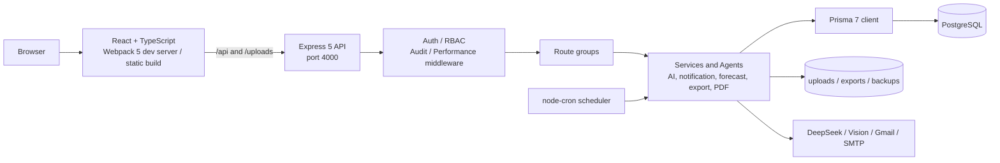

# OptiMind ERP Portal

OptiMind 是一个面向企业采购、供应商履约和财务预算管理的全栈 ERP 门户。系统把采购申请到付款的流程、部门预算预测、供应商库存、通知、审计和 AI 助手集中在一个 Web 应用中，并支持 English、简体中文和 Bahasa Malaysia。

本 README 描述当前代码库的真实结构和运行方式（更新于 2026-08-31）。历史设计稿和旧实现请通过 [文档索引](DOCS-INDEX.md) 查找。

## 产品能力

| 领域 | 能力 |
| --- | --- |
| 身份与访问 | 登录、忘记/重置密码、用户资料和头像、角色与部门管理、基于角色的页面访问 |
| 采购工作流 | Purchase Request、Executive review、Purchase Order、Manager approval、通知和状态追踪 |
| 供应商履约 | 订单确认、交付、Goods Received Note（GRN）、差异处理、库存和可用量预留 |
| 财务 | 供应商发票审核、付款处理、银行资料、税务规则和 PDF 单据 |
| 预算 | 月度预算、已用/预留金额、部门预算调整申请、历史趋势、AI 预测和风险信号 |
| AI 助手 | Chatbot、多 Agent（purchase、analytics、approval、supplier、document）、工具调用、流式回答、会话历史、文件/图片分析 |
| 协作与治理 | In-app/email 通知、Gmail OAuth、反馈、操作审计、数据库/文件备份、性能和日志面板 |
| 输出与本地化 | PDF、Excel、CSV、JSON 导出；English、中文、Bahasa Malaysia 三语切换 |

## 技术栈

- **Frontend:** React 18、TypeScript 5、React Router 6、Ant Design 6、i18next、Axios、Recharts/Ant Design Charts、Webpack 5
- **Backend:** Node.js（ES modules）、Express 5、Prisma 7、PostgreSQL、Multer、Sharp、Puppeteer、ExcelJS、node-cron
- **AI/Integrations:** DeepSeek（OpenAI-compatible API）、Anthropic SDK、Google Cloud Vision 或 OpenAI Vision、Google Gmail API、SMTP/Nodemailer、reCAPTCHA v2
- **Quality:** Vitest、Supertest、Testing Library；后端集成测试默认单 worker 顺序运行，以避免共享数据库冲突

## 架构总览



### 代码边界

```text
.
├── backend/
│   ├── server.js                 # Express 入口，端口 4000
│   ├── routes/                   # HTTP route groups
│   ├── controllers/             # Request handlers
│   ├── services/                 # 业务服务、AI、通知、导出、备份
│   ├── agents/                   # BaseAgent + concrete AI agents
│   ├── middleware/               # 身份、角色、上传、审计等中间件
│   ├── prisma/schema.prisma      # PostgreSQL schema + migrations
│   ├── templates/                # Handlebars documents and print styles
│   ├── uploads/                  # Local uploaded files (runtime data)
│   └── tests/, test/, __tests__/ # Unit, route and integration tests
├── client/
│   ├── src/index.tsx             # React bootstrap + error boundary
│   ├── src/FrontEnd/App.tsx      # Router, layout, role-aware navigation
│   ├── src/FrontEnd/pages/       # Feature pages
│   ├── src/FrontEnd/modules/     # Feature/domain logic
│   ├── src/FrontEnd/shared/      # API wrappers, types, auth, utilities
│   └── webpack.config.cjs        # Build, code splitting and API proxy
├── docs/                         # Setup, feature and implementation docs
├── Diagram/                      # PlantUML ERD, sequence, activity and deployment diagrams
├── scripts/                      # Repository-level utilities
└── DOCS-INDEX.md                 # Documentation navigation
```

## 快速启动

### 环境要求

- Node.js 20 LTS 或更新版本（本仓库当前环境使用 Node 24）
- npm 10+
- PostgreSQL 14+（推荐 PostgreSQL 17）
- Git
- AI、SMTP、Gmail 或 Vision 集成均为可选；没有配置时，核心 ERP 和本地开发仍可启动

### 1. 安装依赖

```powershell
git clone <repository-url>
cd FYP-MoeyChingWei

cd backend
npm ci
npm run prisma:generate

cd ..\client
npm ci
```

没有 lockfile 的环境可以把 `npm ci` 换成 `npm install`。

### 2. 配置 PostgreSQL 和环境变量

创建数据库（例如 `FYPData`），然后复制模板：

```powershell
Copy-Item backend\.env.example backend\.env
```

至少在 `backend/.env` 设置：

```dotenv
DATABASE_URL=postgresql://postgres:<password>@localhost:5432/FYPData?schema=public
SUPER_ADMIN_EMAIL=admin@example.com
SUPER_ADMIN_PASSWORD=<strong-development-password>
SUPER_ADMIN_NAME=Super Admin
```

前端可创建 `client/.env`：

```dotenv
PORT=3000
REACT_APP_API_URL=http://localhost:4000/api
REACT_APP_ENABLE_WORKFLOW_SYNC=true
REACT_APP_RECAPTCHA_SITE_KEY=<recaptcha-v2-site-key>
```

完整变量表见下方「环境变量」。不要提交 `.env`、OAuth token、Google service-account JSON、上传文件或数据库备份。

### 3. 初始化 schema 和管理员

```powershell
cd backend
npm run prisma:migrate       # 本地开发：创建并应用 migration
npm run admin:create         # 使用 SUPER_ADMIN_* 创建/更新管理员
```

已有 migration 的测试/部署环境可使用：

```powershell
npx prisma migrate deploy
```

若使用已有数据库备份，请先恢复 PostgreSQL，再执行 `npm run prisma:generate`；不要在生产数据库直接运行 `prisma db push`。

### 4. 启动开发服务器

在两个终端分别执行：

```powershell
# Terminal 1 - API + scheduler
cd backend
npm run dev

# Terminal 2 - React + Webpack
cd client
npm start
```

访问：

- 前端：<http://localhost:3000>
- API/control center：<http://localhost:4000>
- 性能 JSON：<http://localhost:4000/api/debug/performance>
- 数据库 explorer：<http://localhost:4000/api/database/explorer>

根目录也提供快捷命令：`npm run backend` 启动后端，`npm run dev` 启动前端，`npm run build` 构建前端生产包。Webpack dev server 会把 `/api` 和 `/uploads` 代理到 `http://localhost:4000`，并支持通过 `PORT=3001` 更换前端端口。

后端 `/` 是监控、备份、数据库和审计工具的 control center，不是生产静态前端托管页。生产环境应将 `client/build` 部署到静态 Web server/CDN，并把 `/api`、`/uploads` 反向代理到 Express。

## 环境变量

| 变量 | 必需 | 用途 |
| --- | --- | --- |
| `DATABASE_URL` | 是 | PostgreSQL connection string |
| `SUPER_ADMIN_EMAIL`, `SUPER_ADMIN_PASSWORD`, `SUPER_ADMIN_NAME` | 初始化管理员时 | `npm run admin:create` 的管理员资料 |
| `API_PUBLIC_BASE` | 否 | 上传头像/图片对外可访问的 base URL |
| `RECAPTCHA_SECRET` | 否 | 后端验证 reCAPTCHA v2；配置后登录/重置流程会要求 token |
| `SMTP_HOST`, `SMTP_PORT`, `SMTP_SECURE`, `SMTP_USER`, `SMTP_PASS`, `SMTP_FROM` | 否 | 密码重置和工作流邮件；未配置时本地会记录验证码到终端 |
| `SYSTEM_NOTIFICATION_RECIPIENTS` | 否 | 系统通知邮件收件人列表（逗号分隔） |
| `DEEPSEEK_API_KEY`, `DEEPSEEK_MODEL`, `DEEPSEEK_MAX_TOKENS` | AI 对话时 | Chatbot 和多 Agent；默认模型为 `deepseek-chat` |
| `CLAUDE_API_KEY`, `CLAUDE_DEFAULT_MODEL`, `CLAUDE_MAX_TOKENS` | 可选 | Claude 服务适配器 |
| `VISION_PROVIDER` | 图片分析时 | `google` 或 `openai` |
| `GOOGLE_APPLICATION_CREDENTIALS` / `GOOGLE_VISION_API_KEY` | Google Vision 时 | Vision 凭据 |
| `OPENAI_API_KEY`, `VISION_MODEL` | OpenAI Vision 时 | Vision API 凭据和模型 |
| `GOOGLE_OAUTH_CLIENT_FILE`, `GOOGLE_OAUTH_REDIRECT_URI` | Gmail OAuth 时 | OAuth client JSON 路径和 callback |
| `GMAIL_OAUTH_TOKEN_FILE`, `GMAIL_OAUTH_TOKEN_STORE_FILE` | Gmail OAuth 时 | OAuth token 存储路径 |
| `CLIENT_URL` / `FRONTEND_URL` | Gmail OAuth 时 | OAuth 完成后的前端回跳地址 |
| `BUDGET_PREDICTION_CRON` | 否 | 预算预测 cron；默认 `0 0 28 * *` |
| `PG_DUMP_PATH` | 备份时可选 | 自定义 `pg_dump` 可执行文件路径 |
| `DEBUG` | 否 | 开启更详细的服务日志 |

前端变量必须以 `REACT_APP_` 开头才能被 `client/webpack.config.cjs` 注入浏览器 bundle。API key、SMTP password 和数据库密码只能放在后端环境变量中。

## API route groups

所有业务 API 使用 `/api` 前缀：

| Prefix | 范围 |
| --- | --- |
| `/api/login`, `/api/profile`, `/api/forgot-password` | 认证、密码重置、个人资料 |
| `/api/admin` | 用户、角色和 role-change audit |
| `/api/purchasing` | lookups、supplier inventory、库存预留 |
| `/api/workflow` | purchase requests、orders、acknowledgements、deliveries、GRNs 的 JSON workflow store |
| `/api/supplier-finance`, `/api/supplier-tax` | 发票、付款、银行和税务 |
| `/api/budget`, `/api/department-budget` | 预测、预算、调整、使用量和趋势 |
| `/api/chatbot`, `/api/agents`, `/api/sources` | Chatbot、multi-agent、文件 source 和附件 |
| `/api/notifications`, `/api/feedback`, `/api/dashboard` | 通知、反馈和 dashboard statistics |
| `/api/export` | PDF、Excel、CSV、JSON 和 workflow HTML |
| `/api/gmail` | Gmail OAuth、状态和 labels |
| `/api/audit`, `/api/backup`, `/api/database`, `/api/debug` | 运维、审计、备份、数据库查看和性能指标 |

建议新增 endpoint 时同步更新对应的 `backend/routes/*.js`、前端 `client/src/FrontEnd/shared/api/` wrapper 和测试。

## 角色模型

当前角色定义在 `backend/constants/roles.js` 和 `client/src/FrontEnd/shared/types/roles.ts`：

`Admin`、`Manager`、`Department Executive`、`Account Payable`、`Treasury / Finance Officer`、`Payment Team`、`Budget Controller`、`Employee`、`Supplier`。

角色检查由后端 route middleware 执行，前端路由和菜单只负责用户体验层的隐藏/跳转，不能作为唯一的安全边界。

## 性能与工程设计

已经落地的设计：

- **按路由懒加载：** `App.tsx` 使用 `React.lazy` + `Suspense` 拆分 dashboard、采购、供应商、财务和设置页面；Webpack 使用 `contenthash` 生成可缓存 chunk。
- **请求性能观测：** `performanceMiddleware` 记录 endpoint 调用次数、平均耗时、错误数和慢请求（超过 500 ms），可在 `/api/debug/performance` 查看。
- **数据库访问：** Prisma adapter 使用 PostgreSQL pool；schema 为用户、通知、工作流、预算、聊天和审计查询建立索引，并使用唯一约束保护 lookup、预算和 localId 数据。
- **一致性写入：** workflow storage 以 client-generated `localId` 做 upsert，并以原子 replace 方式同步移除记录；状态变化后触发通知处理。
- **AI 响应效率：** Agent 支持普通和 SSE stream 对话；DeepSeek adapter 对网络、429 和 5xx 使用最多三次 exponential backoff retry。
- **后台任务：** node-cron 执行月度预算预测和 deadline checks；部门通知使用并行 Promise 批量处理。
- **文件与输出：** Multer 处理上传，Sharp 处理图片，Puppeteer/Handlebars 生成 PDF，ExcelJS/JSON2CSV 生成结构化导出。
- **前端体验：** CSS Modules 限制样式污染，Axios wrapper 集中 API 调用，error boundary 防止单个渲染错误使整个页面无反馈。

当前 `npm run build` 可以成功完成，但 Webpack 会提示主 bundle 约 7.13 MiB，部分懒加载 chunk 也超过推荐阈值（最大约 10.9 MiB）。后续性能工作应优先处理 vendor 分包、Ant Design/Charts 的按需导入、AI/导出页面的更细粒度边界，以及 bundle analyzer 基线，而不是只增加更多页面级 lazy import。

生产环境加固建议：

1. 为 Express 增加 rate limiting、严格 CORS、请求 schema validation 和统一 error handler。
2. 将当前通过 `userId + email` 验证请求身份的 demo-level 机制升级为 HttpOnly secure session 或短期 JWT + refresh token，并集中处理 CSRF。
3. 把 uploads、exports、backups 和 OAuth token 迁移到对象存储/secret manager；多实例部署时不要依赖本机文件系统。
4. scheduler 采用单独 worker 或分布式锁，避免多副本重复生成预算和发送通知。
5. 将目前进程内的 debug/performance metrics 接入 Prometheus/OpenTelemetry，并设置日志保留和告警策略。
6. 将 100 MB JSON body limit、上传 MIME/大小限制和 Puppeteer 资源消耗按实际流量重新评估。

## 测试、构建与日常开发

```powershell
# Backend unit/integration tests
cd backend
npm test

# Watch mode
npm run test:watch

# Frontend production bundle
cd ..\client
npm run build
```

后端测试依赖 `DATABASE_URL`，部分集成测试会写入数据库；建议使用独立的 test database。测试配置位于 `backend/vitest.config.js`，当前固定单 worker、关闭文件并行，以降低数据库互相干扰。

可用的辅助脚本包括：

- `npm run prisma:studio`：打开 Prisma Studio
- `npm run forecast:seed-users` / `npm run forecast:seed-purchasing`：准备预算预测测试资料
- `backend/scripts/health-check.cjs`、`verify-server-running.js`：检查本地服务状态
- `test-agents.http`：手动调用 multi-agent endpoint 的 HTTP 请求样例

## 文档和图表

- [文档索引](DOCS-INDEX.md)
- [核心技术文档](docs/01-core/DOCUMENTATION.md)
- [文档组织说明](docs/01-core/README-DOCS.md)
- [Backend setup](docs/02-setup-guides/backend/README.md)
- [Frontend setup](docs/02-setup-guides/frontend/README.md)
- [Multi-agent system](docs/03-features/ai-agents/MULTI_AGENT_SYSTEM.md)
- [多语言使用指南](docs/03-features/i18n/i18n-usage-guide.md)
- [PlantUML diagram pack](Diagram/README.md)

`Diagram/` 目录包含 ERD、系统架构、部署、组件、DFD、状态、活动和 sequence diagrams；修改 workflow 或数据库关系时应一并检查相关 `.puml` 文件。

## 数据、备份与安全边界

- `backend/prisma/migrations/` 是 schema 的迁移来源；`backend/backups/`、根目录 `backups/` 和 `uploads/` 可能含有真实/测试数据，不应部署为公开静态资源。
- `backend/.env`、`client/.env`、Google service-account、Gmail token 和 SMTP/API credentials 不应提交到 Git。
- 备份 endpoint 和数据库 explorer 属于运维能力，应在生产环境置于内网、VPN 或额外管理员认证之后。
- 当前仓库是 Final Year Project（FYP）系统，不附带生产 SLA 或云端部署凭据；部署前请完成上面的加固清单和数据脱敏检查。

## License

本项目为 Final Year Project，当前没有单独发布的开源许可证。对外分发或商业使用前，请先确认项目所有者和第三方依赖的许可条件。
